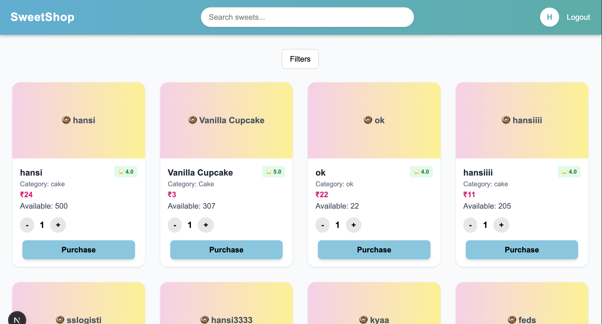

# 🍬 SweetShop Frontend

link: https://sweetshop-frontend-pink.vercel.app/

A modern **Next.js 13+** frontend for the SweetShop application.
This project provides a user-friendly interface for browsing sweets, purchasing items, and managing inventory (admin only).

Built with:

- ⚡ [Next.js](https://nextjs.org/) (App Router)
- 🎨 [TailwindCSS](https://tailwindcss.com/)
- 🔒 JWT-based Authentication with Context API
- 🌐 Axios for API requests
- 🛠️ TypeScript for type safety

---

## 🚀 Features

- User authentication (login & register)
- Browse sweets with filters and search
- Purchase sweets (user flow)
- Add / edit sweets (admin flow)
- Secure route protection
- Responsive design

## 🔑 Environment Variables

Create a `.env.local` file (use `.env.local.example` as reference):

```env
NEXT_PUBLIC_API_URL=http://localhost:8080/api
```

👉 This means you need to have the **Spring Boot backend** running locally at `http://localhost:8080`.

The backend repository is available here:

🔗 [Sweet Shop Backend](https://github.com/itsdeekshit098/sweetshop-backend)

## Getting Started

First, run the development server:

```bash
npm run dev
# or
yarn dev
# or
pnpm dev
# or
bun dev
```

Open [http://localhost:3000](http://localhost:3000) with your browser to see the result.

🏠 Landing Page


🔑 Login Page


📝 Register Page


👑 Admin Login (options to add, update/restock, and delete sweets)


🙋 User Login ((only option is to purchase sweets; cannot add, update, or delete))


✅ Search Functionality

==>Hits the backend endpoint and lists sweet items matching the entered characters in their name.

==>On clicking an item, it will display as shown in the second image.


✅ Scroll to Item
When an item is clicked in the dropdown of the search bar, the page smoothly scrolls to that sweet.


✅ Filter
Users can filter sweets by category or price range.


✅ Add Sweet (Admin Only)


✅ Update Sweet
On clicking the update button, this form is displayed.
Entering the restock quantity will add it to the existing stock.


✅ Logout
On clicking logout, the user will be signed out.


🔒 Edge Cases Handled:

If the user is already logged in, they cannot access the login or register page.

Role-based restrictions ensure only admins can add, update, or delete sweets.

📞 **Contact for Demo:**

    **Deekshith**

**
📱 8143714450**
